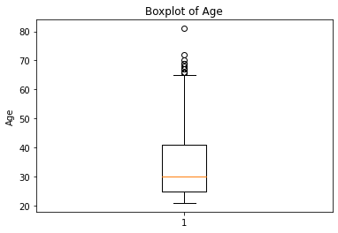

# Project - Diabetes Analysis

---------------
## Context
---------------

Diabetes is one of the most frequent diseases worldwide and the number of diabetic patients are growing over the years. The main cause of diabetes remains unknown, yet scientists believe that both genetic factors and environmental lifestyle play a major role in diabetes.

A few years ago research was done on a tribe in America which is called the Pima tribe (also known as the Pima Indians). In this tribe, it was found that the ladies are prone to diabetes very early. Several constraints were placed on the selection of these instances from a larger database. In particular, all patients were females at least 21 years old of Pima Indian heritage. 

-----------------
## Objective
-----------------

Here, we are analyzing different aspects of Diabetes in the Pima tribe by doing Exploratory Data Analysis.

-------------------------
## Data Dictionary
-------------------------

The dataset has the following information:

* Pregnancies: Number of times pregnant
* Glucose: Plasma glucose concentration over 2 hours in an oral glucose tolerance test
* BloodPressure: Diastolic blood pressure (mm Hg)
* SkinThickness: Triceps skin fold thickness (mm)
* Insulin: 2-Hour serum insulin (mu U/ml)
* BMI: Body mass index (weight in kg/(height in m)^2)
* DiabetesPedigreeFunction: A function which scores likelihood of diabetes based on family history.
* Age: Age in years
* Outcome : Class variable (0: person is not diabetic or 1: person is diabetic)

### Import the necessary libraries


```python
import numpy as np
import pandas as pd

import seaborn as sns
import matplotlib.pyplot as plt
%matplotlib inline

from sklearn.preprocessing import StandardScaler
from sklearn.linear_model import LogisticRegression
from sklearn.ensemble import RandomForestClassifier
```

### The use of each library
"numpy" is for NUMerical PYthon, an essential component for scientific computing. It is advantegous to linear algebra, vector calculus, etc.

"pandas" is for PANel DAta, Offer great help in data manipulation and exploratory data analysis.

"seaborn" provides statistical graphics essentially, with plenty of colors and concepts.

"matplotlib" comes handy in data visualisation with 2D plotting large arrays of datasets. With "inline" the graphs can be displayed right after the input commands.


### Read the given dataset


```python
pima = pd.read_csv("diabetes.csv")
```

### Show the last 5 records of the dataset


```python
pima.tail()
```


<div>
<style scoped>
    .dataframe tbody tr th:only-of-type {
        vertical-align: middle;
    }

    .dataframe tbody tr th {
        vertical-align: top;
    }

    .dataframe thead th {
        text-align: right;
    }
</style>
<table border="1" class="dataframe">
  <thead>
    <tr style="text-align: right;">
      <th></th>
      <th>Pregnancies</th>
      <th>Glucose</th>
      <th>BloodPressure</th>
      <th>SkinThickness</th>
      <th>Insulin</th>
      <th>BMI</th>
      <th>DiabetesPedigreeFunction</th>
      <th>Age</th>
      <th>Outcome</th>
    </tr>
  </thead>
  <tbody>
    <tr>
      <th>995</th>
      <td>2</td>
      <td>173</td>
      <td>79</td>
      <td>32</td>
      <td>474</td>
      <td>35.504233</td>
      <td>0.402867</td>
      <td>21</td>
      <td>1</td>
    </tr>
    <tr>
      <th>996</th>
      <td>13</td>
      <td>132</td>
      <td>70</td>
      <td>30</td>
      <td>111</td>
      <td>35.271769</td>
      <td>0.168845</td>
      <td>42</td>
      <td>1</td>
    </tr>
    <tr>
      <th>997</th>
      <td>3</td>
      <td>132</td>
      <td>87</td>
      <td>44</td>
      <td>156</td>
      <td>34.794755</td>
      <td>0.765003</td>
      <td>29</td>
      <td>1</td>
    </tr>
    <tr>
      <th>998</th>
      <td>0</td>
      <td>140</td>
      <td>0</td>
      <td>0</td>
      <td>0</td>
      <td>41.926693</td>
      <td>0.209833</td>
      <td>28</td>
      <td>1</td>
    </tr>
    <tr>
      <th>999</th>
      <td>4</td>
      <td>93</td>
      <td>59</td>
      <td>35</td>
      <td>93</td>
      <td>45.914499</td>
      <td>0.737636</td>
      <td>29</td>
      <td>1</td>
    </tr>
  </tbody>
</table>
</div>


### Show the first 5 records of the dataset


```python
pima.head()
```


<div>
<style scoped>
    .dataframe tbody tr th:only-of-type {
        vertical-align: middle;
    }

    .dataframe tbody tr th {
        vertical-align: top;
    }

    .dataframe thead th {
        text-align: right;
    }
</style>
<table border="1" class="dataframe">
  <thead>
    <tr style="text-align: right;">
      <th></th>
      <th>Pregnancies</th>
      <th>Glucose</th>
      <th>BloodPressure</th>
      <th>SkinThickness</th>
      <th>Insulin</th>
      <th>BMI</th>
      <th>DiabetesPedigreeFunction</th>
      <th>Age</th>
      <th>Outcome</th>
    </tr>
  </thead>
  <tbody>
    <tr>
      <th>0</th>
      <td>6</td>
      <td>148</td>
      <td>72</td>
      <td>35</td>
      <td>0</td>
      <td>33.6</td>
      <td>0.627</td>
      <td>50</td>
      <td>1</td>
    </tr>
    <tr>
      <th>1</th>
      <td>1</td>
      <td>85</td>
      <td>66</td>
      <td>29</td>
      <td>0</td>
      <td>26.6</td>
      <td>0.351</td>
      <td>31</td>
      <td>0</td>
    </tr>
    <tr>
      <th>2</th>
      <td>8</td>
      <td>183</td>
      <td>64</td>
      <td>0</td>
      <td>0</td>
      <td>23.3</td>
      <td>0.672</td>
      <td>32</td>
      <td>1</td>
    </tr>
    <tr>
      <th>3</th>
      <td>1</td>
      <td>89</td>
      <td>66</td>
      <td>23</td>
      <td>94</td>
      <td>28.1</td>
      <td>0.167</td>
      <td>21</td>
      <td>0</td>
    </tr>
    <tr>
      <th>4</th>
      <td>0</td>
      <td>137</td>
      <td>40</td>
      <td>35</td>
      <td>168</td>
      <td>43.1</td>
      <td>2.288</td>
      <td>33</td>
      <td>1</td>
    </tr>
  </tbody>
</table>
</div>


### Find the dimension of the `pima` dataframe.


```python
#remove _____ & write the appropriate function name

pima.ndim
```


    2


#### What do we understand by the dimension of the dataset?
Since a dataset can consist of many dimensions, "the dimension of the dataset" means the number of dimensions it is made of; for an array it is 1, for a dataframe it is 2 (rows and columns), etc.
### Find the size of the `pima` dataframe.


```python
#remove _____ & write the appropriate function name

pima.shape
```


    (1000, 9)


#### What do we understand by the dimension of the dataset?
The dataset is in the size of 1000 rows and 9 columns.
### Display the data types of all the variables in the data set.


```python
pima.dtypes
```


    Pregnancies                   int64
    Glucose                       int64
    BloodPressure                 int64
    SkinThickness                 int64
    Insulin                       int64
    BMI                         float64
    DiabetesPedigreeFunction    float64
    Age                           int64
    Outcome                       int64
    dtype: object


### Are there any missing values in the `pima` dataframe? 


```python
pima.isnull().values.any()
```


    False


#### Which variables have missing values?
There are no missing values in the pima dataframe.
### Find the summary statistics for all variables except for  `'Outcome'` variable. 


```python
#remove _____ & write the appropriate function name

pima.iloc[:,:(pima.columns.get_loc('Outcome'))].describe()
```


<div>
<style scoped>
    .dataframe tbody tr th:only-of-type {
        vertical-align: middle;
    }

    .dataframe tbody tr th {
        vertical-align: top;
    }

    .dataframe thead th {
        text-align: right;
    }
</style>
<table border="1" class="dataframe">
  <thead>
    <tr style="text-align: right;">
      <th></th>
      <th>Pregnancies</th>
      <th>Glucose</th>
      <th>BloodPressure</th>
      <th>SkinThickness</th>
      <th>Insulin</th>
      <th>BMI</th>
      <th>DiabetesPedigreeFunction</th>
      <th>Age</th>
    </tr>
  </thead>
  <tbody>
    <tr>
      <th>count</th>
      <td>1000.000000</td>
      <td>1000.00000</td>
      <td>1000.000000</td>
      <td>1000.000000</td>
      <td>1000.000000</td>
      <td>1000.000000</td>
      <td>1000.000000</td>
      <td>1000.000000</td>
    </tr>
    <tr>
      <th>mean</th>
      <td>4.051000</td>
      <td>125.21600</td>
      <td>69.072000</td>
      <td>20.755000</td>
      <td>83.086000</td>
      <td>32.664772</td>
      <td>0.494090</td>
      <td>33.830000</td>
    </tr>
    <tr>
      <th>std</th>
      <td>3.325576</td>
      <td>32.27772</td>
      <td>20.465328</td>
      <td>16.008599</td>
      <td>117.255326</td>
      <td>7.563614</td>
      <td>0.322158</td>
      <td>11.268189</td>
    </tr>
    <tr>
      <th>min</th>
      <td>0.000000</td>
      <td>0.00000</td>
      <td>0.000000</td>
      <td>0.000000</td>
      <td>0.000000</td>
      <td>0.000000</td>
      <td>0.078000</td>
      <td>21.000000</td>
    </tr>
    <tr>
      <th>25%</th>
      <td>1.000000</td>
      <td>102.00000</td>
      <td>64.000000</td>
      <td>0.000000</td>
      <td>0.000000</td>
      <td>28.275000</td>
      <td>0.258750</td>
      <td>25.000000</td>
    </tr>
    <tr>
      <th>50%</th>
      <td>3.000000</td>
      <td>122.00000</td>
      <td>72.000000</td>
      <td>24.000000</td>
      <td>23.000000</td>
      <td>32.800000</td>
      <td>0.408500</td>
      <td>30.000000</td>
    </tr>
    <tr>
      <th>75%</th>
      <td>6.000000</td>
      <td>146.00000</td>
      <td>80.000000</td>
      <td>33.000000</td>
      <td>133.500000</td>
      <td>36.900000</td>
      <td>0.658500</td>
      <td>41.000000</td>
    </tr>
    <tr>
      <th>max</th>
      <td>17.000000</td>
      <td>199.00000</td>
      <td>122.000000</td>
      <td>99.000000</td>
      <td>846.000000</td>
      <td>67.100000</td>
      <td>2.420000</td>
      <td>81.000000</td>
    </tr>
  </tbody>
</table>
</div>


#### Choose any one column/variable and explain all the statistical measures.
The statistics of "Insulin";
"count": Holds 1000 observations/values.
"mean": The arithmetic average of the values, which is 83.086
"std": The square root of the variance, which is 117.255326, far surpasses its mean. Indicates severe ourliers.
"min": The lowest value, which is 0.
"25%": First quartile, which is also 0. Might produce a left-skewed distribution.
"50%": The value in the middle, which is 23 (far below the mean) that also indicates a heavily left-skewed dist.
"75%": Third quartile, which is 133.5 that is higher than the mean, nevertheless still lower than the sum of mean and std.
"max": The highest value, which is a whopping 846, confirming a heavily left-skewed distribution because of outliers.
### Plot the distribution plot for the variable `'BloodPressure'`. 


```python
sns.displot(pima['BloodPressure'], kind='kde')
plt.show()
```


    

    


#### Observations from the plot.
The overwhelming majority of the Blood Pressure values are between the range 50 to 100.
### What is the `'BMI'` for the person having the highest `'Glucose'`?


```python
pima[pima['Glucose']==pima['Glucose'].max()]['BMI']
```


    661    42.9
    Name: BMI, dtype: float64


The person with the highest Glucose value (661) has a BMI of 42.9
#### What is the mean of the variable `'BMI'`? 
#### What is the median of the variable `'BMI'`? 
#### What is the mode of the variable `'BMI'`?
#### Are the three measures of central tendency equal?


```python
m1 = pima['BMI'].mean()  #Mean
print(m1)
m2 = pima['BMI'].median()  #Median
print(m2)
m3 = pima['BMI'].mode()[0]  #Mode
print(m3)
```

    32.664772391408796
    32.8
    32.0
    
The variable 'BMI' has a mean of ~32.66, a median of 32.8 and a mode of 32.0
The three masures of central tendency are not exactly equal, yet pretty close to each other.
### How many women's `'Glucose'` level is above the mean level of `'Glucose'`?


```python
pima[pima['Glucose']>pima['Glucose'].mean()].shape[0]
```


    449


Of the total of 1000 'Glucose' level observations, 449 of them are above the mean level of it.
### Create the pairplot for variables `'Glucose'`, `'SkinThickness'` and `'DiabetesPedigreeFunction'`. 


```python
sns.pairplot(data=pima, vars=['Glucose', 'SkinThickness', 'DiabetesPedigreeFunction'], hue='Outcome')
plt.show()
```


    

    


#### Observations from the plot.
The relationship between all the numerical variables are displayed. 'Glucose' and 'DiabetesPedigreeFunction' are negatively skewed, with some outliers. The same relationship goes for 'Glucose' and 'SkinThickness', where the former has a substantial influence over the latter. A similar level of bias can be observed between 'SkinThickness' and 'DiabetesPedigreeFunction', although they are positively skewed.
### Plot the scatterplot between `'Glucose'` and `'Insulin'`. 


```python
sns.scatterplot(x='Glucose',y='Insulin',data=pima)
plt.show()
```


    

    


#### Observations from the plot
Glucose and Insulin has a moderately positive linear relationship with each other, where the Insulin amount is increasing with an increasing level of Glucose. However, there are also a handful amount of values where Insulin is not affected at all by Glucose.
### Plot the boxplot for the 'Age' variable


```python
plt.boxplot(pima['Age'])

plt.title('Boxplot of Age')
plt.ylabel('Age')
plt.show()
```


    

    


#### Are there outliers?
The boxplot shows that there are plenty of outliers (the circles above the upper line at the Age of ~65)
### Find and visualize the the correlation matrix


```python
corr_matrix = pima.iloc[:,0:8].corr()

corr_matrix
```


<div>
<style scoped>
    .dataframe tbody tr th:only-of-type {
        vertical-align: middle;
    }

    .dataframe tbody tr th {
        vertical-align: top;
    }

    .dataframe thead th {
        text-align: right;
    }
</style>
<table border="1" class="dataframe">
  <thead>
    <tr style="text-align: right;">
      <th></th>
      <th>Pregnancies</th>
      <th>Glucose</th>
      <th>BloodPressure</th>
      <th>SkinThickness</th>
      <th>Insulin</th>
      <th>BMI</th>
      <th>DiabetesPedigreeFunction</th>
      <th>Age</th>
    </tr>
  </thead>
  <tbody>
    <tr>
      <th>Pregnancies</th>
      <td>1.000000</td>
      <td>0.112930</td>
      <td>0.127463</td>
      <td>-0.080033</td>
      <td>-0.064909</td>
      <td>0.012920</td>
      <td>-0.025452</td>
      <td>0.548665</td>
    </tr>
    <tr>
      <th>Glucose</th>
      <td>0.112930</td>
      <td>1.000000</td>
      <td>0.134993</td>
      <td>0.050656</td>
      <td>0.334175</td>
      <td>0.222138</td>
      <td>0.127004</td>
      <td>0.255567</td>
    </tr>
    <tr>
      <th>BloodPressure</th>
      <td>0.127463</td>
      <td>0.134993</td>
      <td>1.000000</td>
      <td>0.249063</td>
      <td>0.117369</td>
      <td>0.247275</td>
      <td>0.059303</td>
      <td>0.240416</td>
    </tr>
    <tr>
      <th>SkinThickness</th>
      <td>-0.080033</td>
      <td>0.050656</td>
      <td>0.249063</td>
      <td>1.000000</td>
      <td>0.472663</td>
      <td>0.387055</td>
      <td>0.214026</td>
      <td>-0.121236</td>
    </tr>
    <tr>
      <th>Insulin</th>
      <td>-0.064909</td>
      <td>0.334175</td>
      <td>0.117369</td>
      <td>0.472663</td>
      <td>1.000000</td>
      <td>0.198281</td>
      <td>0.180284</td>
      <td>-0.039887</td>
    </tr>
    <tr>
      <th>BMI</th>
      <td>0.012920</td>
      <td>0.222138</td>
      <td>0.247275</td>
      <td>0.387055</td>
      <td>0.198281</td>
      <td>1.000000</td>
      <td>0.163270</td>
      <td>0.023921</td>
    </tr>
    <tr>
      <th>DiabetesPedigreeFunction</th>
      <td>-0.025452</td>
      <td>0.127004</td>
      <td>0.059303</td>
      <td>0.214026</td>
      <td>0.180284</td>
      <td>0.163270</td>
      <td>1.000000</td>
      <td>0.006809</td>
    </tr>
    <tr>
      <th>Age</th>
      <td>0.548665</td>
      <td>0.255567</td>
      <td>0.240416</td>
      <td>-0.121236</td>
      <td>-0.039887</td>
      <td>0.023921</td>
      <td>0.006809</td>
      <td>1.000000</td>
    </tr>
  </tbody>
</table>
</div>


```python
plt.figure(figsize=(8,8))
sns.heatmap(corr_matrix, annot = True)

# display the plot
plt.show()
```


    

    


#### Observations from the plot
The above plot shows that there is a reasonable correlation between 'Age' and 'Pregnancies' (0.55). The second significant correlation can be observed between 'Insulin' and 'SkinThickness' (0.47). The diagonal values, on the other hand, are '1' since it represents the correlation of the variable with itself.
    

## Model Training

### Split and scale the data


```python
# Split the data into dependent and independent variables
y = pima.Outcome
x = pima.drop('Outcome', axis = 1)
```


```python
# Using StandarScaler scale the data
from sklearn.preprocessing import StandardScaler
scaler = StandardScaler()
X = scaler.fit_transform(x)
```


```python
# Splitting the data into train and test. Use test size as 15%
from sklearn.model_selection import train_test_split
x_train, x_test, y_train, y_test = train_test_split(x, y, test_size = 0.15, stratify=y,  random_state = 45)
```

### Train a Logistic Regression Model. 


```python
# import the model
from sklearn.linear_model import LogisticRegression

# Instantiate the model
lr = LogisticRegression(max_iter=1000)

# fit the model on the train set
m = lr.fit(x_train, y_train)

# Predict on x_test
y_pred = m.predict(x_test)

# Evaluate the model
print('Accuracy of Logistic Regression model on the train set: {:.2f}'.format(m.score(x_train, y_train)))
print('Accuracy of the Logictic Regression model on the test set: {:.2f}'.format(m.score(x_test, y_test)))

from sklearn.metrics import confusion_matrix
confusion_matrix(y_test, y_pred)
```

    Accuracy of Logistic Regression model on the train set: 0.76
    Accuracy of the Logictic Regression model on the test set: 0.75
    


    array([[60, 15],
           [22, 53]], dtype=int64)


#### What is the Accuracy and how many True Positives and True Negatives did we get?

Accuracy is the total count of true positives and true negatives, devided by all samples count.
In this LR case, the accuracy of the train set is 76%, as for the test set it is 75%.

True Positives count is 60, while True Negatives count is 53.

### Train a Random Forest Model.


```python
# Import the Model
from sklearn.ensemble import RandomForestClassifier

# Instantiate the model. 
rf = RandomForestClassifier(n_estimators=301, max_depth=3)

# fit the model on the train set
m2 = rf.fit(x_train, y_train)

# Predict on x_test
y_pred2 = m2.predict(x_test)

# Evaluate the Model
print('Accuracy of Random Forest model on the train set: {:.2f}'.format(m2.score(x_train, y_train)))
print('Accuracy of Random Forest model on the test set: {:.2f}'.format(m2.score(x_test, y_test)))
confusion_matrix(y_test, y_pred2)
```

    Accuracy of Random Forest model on the train set: 0.82
    Accuracy of Random Forest model on the test set: 0.79
    


    array([[57, 18],
           [14, 61]], dtype=int64)


#### What is the Accuracy and how many True Positives and True Negatives did we get?

The accuracy of RF model on the train set is %82, as for the test set it is 79%.
True Positives count is 57, while True Negatives count is 61.    

### Which model performed better?

We can clearly say that Random Forest model performed better, based on the accuracy numbers, the confusion matrix (True Positive, False Negative etc) and their calculated indexes like Precision and Recall. Both of the accuracy values and F1-score (a harmonic mean of Precision and Recall) are higher than the ones of LR model.
